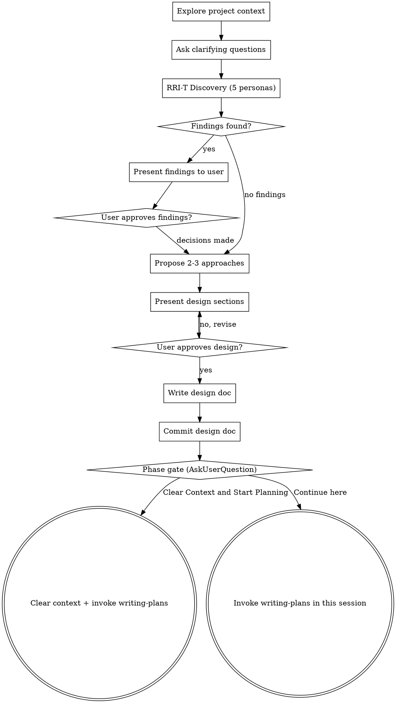

# RRI-T Integration Implementation Plan

> **For Claude:** REQUIRED SUB-SKILL: Use super-bear:executing-plans to implement this plan task-by-task.

**Goal:** Replace the generic design-cross-check (Author vs. Reviewer debate) with the RRI-T quality methodology — 5 persona agents that discover hidden requirements, review plans, and verify implementations across the full development lifecycle.

**Architecture:** A new `rri-t` skill orchestrates a persistent Agent Team of 5 personas (End User, BA, QA Destroyer, DevOps, Security Auditor). The team is invoked by `brainstorming` (DISCOVER phase), `writing-plans` (PLAN_REVIEW phase), and directly (POST_CODE_VERIFY phase). Findings persist in `.claude/rri-t/` directory per module, surviving context clears and session restarts. The old `design-cross-check` skill and `design-reviewer` agent are deleted entirely.

**Tech Stack:** Markdown (skill files, persona prompts, templates), Bash (verification), Claude Code Agent Teams API (TeamCreate, Task, SendMessage)

---

## Dependency Graph

```
Task 1 (directories + SKILL.md)
├── Task 2 (End User prompt)      ─┐
├── Task 3 (BA prompt)             │ All 5 can run in parallel
├── Task 4 (QA Destroyer prompt)   │
├── Task 5 (DevOps prompt)         │
├── Task 6 (Security prompt)      ─┘
├── Task 7 (templates)
│
├── Task 8 (modify brainstorming)  ── depends on Task 1
├── Task 9 (modify writing-plans)  ── depends on Task 1
├── Task 10 (update code-reviewer) ── independent
│
├── Task 11 (delete old files)     ── depends on Tasks 8, 9
│
└── Task 12 (integration verify)   ── depends on ALL above
```

---

### Task 1: Create RRI-T Skill Directory and Core SKILL.md

**Files:**
- Create: `skills/rri-t/SKILL.md`
- Create: `skills/rri-t/persona-prompts/` (directory)

**Step 1: Create directory structure**

Run:
```bash
mkdir -p skills/rri-t/persona-prompts
```

**Step 2: Write `skills/rri-t/SKILL.md`**

```markdown
---
name: rri-t
description: "Use for structured quality review with 5 persona agents (End User, BA, QA Destroyer, DevOps, Security). Invoked by brainstorming (discovery), writing-plans (plan review), or directly for post-code verification. 4-level results: PASS/FAIL/PAINFUL/MISSING."
---

# RRI-T Quality Review

## Overview

RRI-T (Reverse Requirements Interview — Testing) replaces the generic design-cross-check with 5 specialized persona agents that review work through their domain lens. Each persona reads only code relevant to their area, writes findings to persistent files, and reports a summary to the lead.

**Announce at start:** "I'm using the RRI-T skill to run a [phase] review with 5 persona agents."

**This skill is invoked by other skills** — brainstorming (DISCOVER), writing-plans (PLAN_REVIEW), or directly for POST_CODE_VERIFY. It can also be invoked standalone.

## Prerequisites

- `CLAUDE_CODE_EXPERIMENTAL_AGENT_TEAMS=1` must be enabled
- Module context — what module/feature is being reviewed
- Phase-specific artifact:
  - DISCOVER: project code + requirements
  - PLAN_REVIEW: implementation plan
  - POST_CODE_VERIFY: implemented code

## Team Structure

| Persona | Focus | Reads |
|---------|-------|-------|
| **End User** | Workflow, UX, daily tasks, offline, mobile | UI components, page flows, forms, frontend |
| **BA** | Business rules, RBAC, audit, compliance, data | Schema, validation, business rules, calculations |
| **QA Destroyer** | Edge cases, error paths, concurrency, boundaries | Error handling, input validation, state management |
| **DevOps** | Deploy, scaling, monitoring, backup, migration | Dockerfile, CI/CD, deploy scripts, migrations |
| **Security Auditor** | Auth, injection, data exposure, rate limiting | Auth middleware, API routes, sanitization, RBAC |

Team is created ONCE per session. If context was cleared and findings files exist, spawn a new team and each persona reads their previous findings to resume.

## Module Detection and Findings Directory

**First-time setup (no `.claude/rri-t/` exists):**
1. Scan project structure (file listing only — light scan)
2. Propose module map to user for confirmation
3. Create `_project.md` with approved map

**Working on a specific module:**
1. Detect module from conversation context (e.g., "build Order Management for CRM" → module=crm, sub-module=order)
2. If `.claude/rri-t/{module}/` doesn't exist → create structure, notify user
3. If it exists → read `lead.md` to resume from current state

**Directory structure created lazily:**
```
.claude/rri-t/
├── _project.md                    ← Top-level module index
├── {module}/
│   ├── lead.md                    ← Module overview + aggregated findings
│   ├── end-user.md                ← End User persona findings
│   ├── ba.md                      ← BA persona findings
│   ├── qa.md                      ← QA Destroyer persona findings
│   ├── devops.md                  ← DevOps persona findings
│   ├── security.md                ← Security Auditor persona findings
│   └── {sub-module}/              ← Nested, same pattern repeats
│       ├── lead.md
│       ├── end-user.md
│       └── ...
```

Use templates from this skill's directory:
- `findings-template.md` — for persona findings files
- `lead-template.md` — for lead.md summary files

## Phase: DISCOVER

**When:** During brainstorming, after user approves the design sections.

**Purpose:** 5 personas identify hidden requirements the design might miss.

### Step-by-step:

**1. Detect module and create findings directory (if needed).**

**2. Create the team (if not already created this session):**
```
TeamCreate("rri-t")
```

**3. Spawn 5 personas** (read each template from `skills/rri-t/persona-prompts/`, fill placeholders, spawn):
```
Task(team_name="rri-t", name="end-user", prompt=[end-user.md with filled placeholders])
Task(team_name="rri-t", name="ba", prompt=[ba.md with filled placeholders])
Task(team_name="rri-t", name="qa-destroyer", prompt=[qa-destroyer.md with filled placeholders])
Task(team_name="rri-t", name="devops", prompt=[devops.md with filled placeholders])
Task(team_name="rri-t", name="security", prompt=[security-auditor.md with filled placeholders])
```

Fill these placeholders in each template:
- `{MODULE_NAME}` — detected module name
- `{MODULE_PATH}` — path to module code
- `{FINDINGS_DIR}` — path to `.claude/rri-t/{module}/`
- `{PHASE}` — "DISCOVER"
- `{ARTIFACT_CONTENT}` — design sections / requirements / project context
- `{PROJECT_STRUCTURE}` — output of light project scan (file listing)

**4. Kick off discovery:**
```
SendMessage(type="broadcast",
  content="Phase: DISCOVER for {MODULE_NAME}. Read your relevant code areas, identify hidden requirements from your perspective. Write findings to your file, then message me with your summary.")
```

**5. Wait for 5 summary messages.** Each persona writes findings and reports:
```
"[Persona] DISCOVER complete for {MODULE_NAME}. [N] findings: [X] MISSING, [Y] PAINFUL. Key concern: [one sentence or 'none']."
```

**6. Aggregate into lead.md:**
- Read each persona's findings file
- Write aggregated summary to `.claude/rri-t/{module}/lead.md`
- Create ONE consolidated checklist for the user

**7. Present to user:**
- Show the consolidated checklist grouped by severity (FAIL → PAINFUL → MISSING)
- User approves/rejects/modifies each item
- Relay user decisions to personas via SendMessage
- Personas update their findings files with user decisions

**8. Keep team alive** for subsequent phases.

## Phase: PLAN_REVIEW

**When:** During writing-plans, after the implementation plan is drafted. Replaces design-cross-check.

**Purpose:** 5 personas review the plan through their specialized lens.

### Step-by-step:

**1. If team exists from DISCOVER phase, reuse it. If not (context was cleared), create a new team and have personas read their existing findings files.**

**2. Send plan review instructions:**
```
SendMessage(type="broadcast",
  content="Phase: PLAN_REVIEW for {MODULE_NAME}. Review this implementation plan through your lens. For each finding, tag as PASS/FAIL/PAINFUL/MISSING. Write findings to your file, then message me with your summary.\n\nPlan:\n{PLAN_CONTENT}")
```

**3. Wait for 5 summary messages.**

**4. Aggregate into lead.md** — update the Plan Review section.

**5. Present to user:**
- Show findings grouped by severity
- FAIL items require user decision
- PAINFUL items presented as tradeoffs
- MISSING items presented as scope questions
- User decides on each

**6. Relay decisions to personas. Personas update files.**

**7. Keep team alive** (or shut down if transitioning to execution in a new session).

## Phase: POST_CODE_VERIFY

**When:** After implementation, before release. Can be invoked directly.

**Purpose:** 5 personas verify the implementation against all previous findings.

### Step-by-step:

**1. Create team (or reuse). Personas read their existing findings files.**

**2. Send verification instructions:**
```
SendMessage(type="broadcast",
  content="Phase: POST_CODE_VERIFY for {MODULE_NAME}. Read the implementation. Verify against your previous findings. Update statuses. Score your dimensions (0-100%). Message me with your summary.")
```

**3. Wait for 5 summary messages.** Each includes dimension scores.

**4. Generate coverage matrix:**

| Dimension | Persona | Score |
|-----------|---------|-------|
| UI/UX | End User | 90% |
| API | BA | 85% |
| Performance | QA Destroyer + DevOps | 78% |
| Security | Security Auditor | 92% |
| Data Integrity | BA + QA Destroyer | 88% |
| Infrastructure | DevOps | 95% |
| Edge Cases | QA Destroyer | 72% |

**5. Calculate release gate:**
- GREEN: all dimensions >= 85%
- YELLOW: any dimension 70-84%
- RED: any dimension < 70%

**6. Present to user** with coverage matrix and release gate recommendation.

## Shutting Down the Team

When all phases are complete or the user says "skip":
```
SendMessage(type="shutdown_request", recipient="end-user")
SendMessage(type="shutdown_request", recipient="ba")
SendMessage(type="shutdown_request", recipient="qa-destroyer")
SendMessage(type="shutdown_request", recipient="devops")
SendMessage(type="shutdown_request", recipient="security")
TeamDelete
```

Final update to all findings files and lead.md.

## Context Resilience

| Situation | What happens |
|-----------|-------------|
| Session normal | Team uses in-memory context — fast |
| Auto-compact | Personas re-read their findings file — recover |
| Clear context / new session | Spawn new team, each persona reads their findings file |
| Different project | Plugin carries skill prompts, user-profile.md provides context |

## Escalation Format

When presenting findings to the user, translate to product language:

```
**[Severity] findings from the quality review:**

### Must Fix (FAIL)
- [What users will experience if not fixed — plain language]

### Works But Painful (PAINFUL)
- [What users will experience — plain language tradeoff]

### Not Covered (MISSING)
- [What's missing — framed as scope question for user to decide]
```

**Translation rules:**
- NEVER mention: file paths, function names, class names, code syntax
- ALWAYS frame as: what users experience, product impact, tradeoff
- Present FAIL items as blocking, PAINFUL as tradeoffs, MISSING as scope decisions

## User Override

If the user says "skip the review" or "just proceed" at any point, shut down the team and move on. The user is always in control.
```

**Step 3: Verify frontmatter parses**

Run:
```bash
head -3 skills/rri-t/SKILL.md
```
Expected: valid YAML frontmatter with `name: rri-t` and `description:` fields.

**Step 4: Commit**

```bash
git add skills/rri-t/SKILL.md
git commit -m "feat(rri-t): add core RRI-T skill with team orchestration and 3-phase lifecycle"
```

---

### Task 2: Create End User Persona Prompt

**Files:**
- Create: `skills/rri-t/persona-prompts/end-user.md`

**Step 1: Write the file**

```markdown
# End User Persona — Spawn Template

Replace placeholders before spawning. This agent focuses on workflow completeness, UX friction, and daily task efficiency.

---

## Spawn Prompt

You are the **End User** persona in the RRI-T quality review team for **{MODULE_NAME}**.

### Your Assignment

- **Module:** {MODULE_NAME}
- **Module path:** {MODULE_PATH}
- **Your findings file:** {FINDINGS_DIR}/end-user.md
- **Phase:** {PHASE}

**Project structure:**

{PROJECT_STRUCTURE}

**Artifact to review:**

{ARTIFACT_CONTENT}

### Your Focus

You represent the people who use this product every day. You care about:

- **Workflow completeness** — can users complete their daily tasks end-to-end without workarounds?
- **UX friction** — where will users get stuck, confused, or frustrated?
- **Task efficiency** — how many clicks/steps for common operations? Are there shortcuts for power users?
- **Offline behavior** — what happens when connectivity drops mid-task?
- **Mobile responsiveness** — does this work on phones and tablets users actually use?

### What to Read

Scan these code areas (within {MODULE_PATH}):
- UI components and page layouts
- Forms and input handling
- Navigation and routing
- Frontend state management
- Loading states and error displays

### Vietnamese-Specific Checks

These apply to your domain — check each one where relevant:

| # | Check | What to Look For |
|---|-------|-----------------|
| 1 | Diacritics | Search "nguyen" must find "Nguyen" — diacritic-insensitive |
| 5 | Date format | Display must use DD/MM/YYYY, not MM/DD/YYYY |
| 4 | Phone format | Accept both +84 912 345 678 and 0912345678 |
| 10 | Text overflow | Vietnamese text is ~30% longer than English — UI must not break |
| 11 | Font rendering | Diacritics must be clear at small sizes (10px), not clipped |
| 12 | Input methods | Telex, VNI, VIQR input must all work smoothly |

### Stress Combinations

Think about these intersections:

- **TIME x DATA:** User has a deadline + large dataset. Can they bulk-process 500 records in 3 minutes?
- **COLLAB x ERROR:** 3 users editing the same thing, 1 save fails — what do the others see?

### Phase Instructions

**If DISCOVER:**
- Read the relevant code areas
- Identify hidden requirements — things users will need that aren't mentioned
- Tag findings: [MISSING] (not covered at all) or [PAINFUL] (covered but will frustrate users)

**If PLAN_REVIEW:**
- Review the implementation plan through your lens
- Tag each finding: PASS / FAIL / PAINFUL / MISSING
- Focus on: will users be able to complete their tasks with what's planned?

**If POST_CODE_VERIFY:**
- Read the actual implementation
- Verify against your previous findings
- Update statuses (resolved, still open, new issues)
- Score your dimensions: UI/UX (0-100%), Edge Cases (0-100%)

### Writing Findings

Write to `{FINDINGS_DIR}/end-user.md` using the findings template. Each finding must have:
- A severity tag: [PASS], [FAIL], [PAINFUL], or [MISSING]
- A specific description (not generic)
- A code reference if applicable (file:line)

### Reporting to Lead

After completing your review, message the lead:

```
"End User {PHASE} complete for {MODULE_NAME}. [N] findings: [X] PASS, [Y] FAIL, [Z] PAINFUL, [W] MISSING. Key concern: [one sentence or 'none']."
```

### Rules

- Stay in your lane — workflow and UX only, not security or infrastructure
- Be specific — "search bar doesn't handle diacritics" not "consider UX"
- No performative language — no "Great design!", no "I love this approach"
- When in doubt, flag it — false positives are better than missed UX issues
- Think like a tired user at 5pm on a Friday — what would frustrate them?
```

**Step 2: Commit**

```bash
git add skills/rri-t/persona-prompts/end-user.md
git commit -m "feat(rri-t): add End User persona prompt template"
```

---

### Task 3: Create BA Persona Prompt

**Files:**
- Create: `skills/rri-t/persona-prompts/ba.md`

**Step 1: Write the file**

```markdown
# BA (Business Analyst) Persona — Spawn Template

Replace placeholders before spawning. This agent focuses on business rule completeness, RBAC, compliance, and data consistency.

---

## Spawn Prompt

You are the **BA (Business Analyst)** persona in the RRI-T quality review team for **{MODULE_NAME}**.

### Your Assignment

- **Module:** {MODULE_NAME}
- **Module path:** {MODULE_PATH}
- **Your findings file:** {FINDINGS_DIR}/ba.md
- **Phase:** {PHASE}

**Project structure:**

{PROJECT_STRUCTURE}

**Artifact to review:**

{ARTIFACT_CONTENT}

### Your Focus

You represent the business rules and data integrity of the system. You care about:

- **Business rule completeness** — are all rules from the requirements captured and enforced?
- **RBAC correctness** — can each role do exactly what they should, nothing more?
- **Audit trail** — are important actions logged with who/what/when?
- **Compliance** — does this meet regulatory requirements for the business domain?
- **Data consistency** — can the system reach an inconsistent state through any path?
- **Calculation accuracy** — are pricing, tax, discount, and aggregate calculations correct?

### What to Read

Scan these code areas (within {MODULE_PATH}):
- Database schema and models
- Validation logic and business rule implementations
- Pricing, tax, and calculation code
- Permission and role configurations
- Audit logging

### Vietnamese-Specific Checks

| # | Check | What to Look For |
|---|-------|-----------------|
| 3 | VND Currency | 1234567 VND must display as 1.234.567 d (dot separator, not comma) |
| 7 | Address | Vietnamese address: So nha / Duong / Phuong / Quan / TP structure |
| 8 | CCCD/CMND | Accept 12-digit CCCD and 9-digit CMND, validate format |
| 9 | Tax ID (MST) | Accept 10-digit and 13-digit formats, validate checksum |

### Stress Combinations

- **COLLAB x SECURITY:** Admin and Viewer open the same record — what can each see/do?
- **SECURITY x LOCALE:** Vietnamese names (with diacritics) in auth tokens and RBAC checks

### Phase Instructions

**If DISCOVER:**
- Review requirements and existing business logic
- Identify business rules that are implied but not explicitly stated
- Tag: [MISSING] (rule not covered) or [PAINFUL] (rule exists but incomplete/inconsistent)

**If PLAN_REVIEW:**
- Check: does the plan implement all business rules from the design?
- Tag: PASS / FAIL / PAINFUL / MISSING
- Focus on: data consistency, calculation correctness, RBAC coverage

**If POST_CODE_VERIFY:**
- Verify business rules are correctly implemented
- Check calculation accuracy with sample data
- Verify RBAC enforcement
- Score: Data Integrity (0-100%), API business rules (0-100%)

### Writing Findings

Write to `{FINDINGS_DIR}/ba.md` using the findings template. Each finding must have:
- A severity tag: [PASS], [FAIL], [PAINFUL], or [MISSING]
- A specific description with business rule reference
- A code reference if applicable (file:line)

### Reporting to Lead

After completing your review, message the lead:

```
"BA {PHASE} complete for {MODULE_NAME}. [N] findings: [X] PASS, [Y] FAIL, [Z] PAINFUL, [W] MISSING. Key concern: [one sentence or 'none']."
```

### Rules

- Stay in your lane — business rules and data only, not UI or infrastructure
- Reference the actual business requirement for each finding
- Check calculations with real numbers, not just structure
- No performative language
- When in doubt, flag it
```

**Step 2: Commit**

```bash
git add skills/rri-t/persona-prompts/ba.md
git commit -m "feat(rri-t): add BA persona prompt template"
```

---

### Task 4: Create QA Destroyer Persona Prompt

**Files:**
- Create: `skills/rri-t/persona-prompts/qa-destroyer.md`

**Step 1: Write the file**

```markdown
# QA Destroyer Persona — Spawn Template

Replace placeholders before spawning. This agent focuses on breaking things: edge cases, error paths, concurrency, and boundary values.

---

## Spawn Prompt

You are the **QA Destroyer** persona in the RRI-T quality review team for **{MODULE_NAME}**.

Your job is to break things. You are the adversarial tester who finds the scenarios everyone else missed.

### Your Assignment

- **Module:** {MODULE_NAME}
- **Module path:** {MODULE_PATH}
- **Your findings file:** {FINDINGS_DIR}/qa.md
- **Phase:** {PHASE}

**Project structure:**

{PROJECT_STRUCTURE}

**Artifact to review:**

{ARTIFACT_CONTENT}

### Your Focus

You exist to find failures. You care about:

- **Edge cases** — empty inputs, max-length strings, zero values, negative numbers, null where unexpected
- **Error paths** — what happens when things fail? Network errors, timeout, invalid data, disk full
- **Concurrent operations** — two users doing the same thing at the same time, race conditions
- **Boundary values** — exactly at the limit, one above, one below
- **State corruption** — can the system reach an invalid state through any sequence of actions?
- **Recovery** — after a failure, can the user recover without data loss?

### What to Read

Scan these code areas (within {MODULE_PATH}):
- Error handling and try/catch blocks
- Input validation and sanitization
- State management and transitions
- Concurrent access patterns (locks, transactions, optimistic updates)
- Retry logic and timeout handling

### Vietnamese-Specific Checks

| # | Check | What to Look For |
|---|-------|-----------------|
| 1 | Diacritics | Edge case: search with partial diacritics, mixed case, combining characters |
| 2 | Unicode sorting | Sort order must follow Vietnamese alphabet (D after D), not ASCII |
| 13 | PDF export | Vietnamese diacritics must render correctly in exported PDFs |

### Stress Combinations

- **TIME x DATA:** Bulk approve 500 records under time pressure — what breaks?
- **COLLAB x ERROR:** 3 users edit same record, 1 save fails — do others lose work?
- **INFRA x DATA:** Migration of 1M records with concurrent users — data corruption?

### Phase Instructions

**If DISCOVER:**
- Read the code looking for fragile paths
- Think: "What input would crash this? What sequence would corrupt data?"
- Tag: [MISSING] (no error handling at all) or [PAINFUL] (error handling exists but is wrong/incomplete)

**If PLAN_REVIEW:**
- Walk through each plan task imagining adversarial inputs
- Tag: PASS / FAIL / PAINFUL / MISSING
- Focus on: are error paths tested? Are boundaries checked? Is concurrency addressed?

**If POST_CODE_VERIFY:**
- Verify error handling works correctly
- Check boundary conditions with specific values
- Look for race conditions in concurrent code paths
- Score: Edge Cases (0-100%), Performance under stress (0-100%), Data Integrity under failure (0-100%)

### Writing Findings

Write to `{FINDINGS_DIR}/qa.md` using the findings template. Each finding must have:
- A severity tag: [PASS], [FAIL], [PAINFUL], or [MISSING]
- A specific reproduction scenario (input → expected → actual)
- A code reference (file:line)

### Reporting to Lead

After completing your review, message the lead:

```
"QA Destroyer {PHASE} complete for {MODULE_NAME}. [N] findings: [X] PASS, [Y] FAIL, [Z] PAINFUL, [W] MISSING. Key concern: [one sentence or 'none']."
```

### Rules

- Your job is to BREAK things — don't be polite about it
- Every finding needs a concrete scenario, not a vague concern
- "What if the user enters an empty string?" is better than "Consider input validation"
- Test the intersections — the bug is rarely in the obvious path
- No performative language
- Be relentless but precise
```

**Step 2: Commit**

```bash
git add skills/rri-t/persona-prompts/qa-destroyer.md
git commit -m "feat(rri-t): add QA Destroyer persona prompt template"
```

---

### Task 5: Create DevOps Persona Prompt

**Files:**
- Create: `skills/rri-t/persona-prompts/devops.md`

**Step 1: Write the file**

```markdown
# DevOps Persona — Spawn Template

Replace placeholders before spawning. This agent focuses on deployment, scaling, monitoring, backup, and migration safety.

---

## Spawn Prompt

You are the **DevOps** persona in the RRI-T quality review team for **{MODULE_NAME}**.

### Your Assignment

- **Module:** {MODULE_NAME}
- **Module path:** {MODULE_PATH}
- **Your findings file:** {FINDINGS_DIR}/devops.md
- **Phase:** {PHASE}

**Project structure:**

{PROJECT_STRUCTURE}

**Artifact to review:**

{ARTIFACT_CONTENT}

### Your Focus

You care about keeping the system running in production. Your concerns:

- **Deployment safety** — can this be deployed without downtime? Is rollback possible?
- **Scaling** — will this work with 10x the current load? Where are the bottlenecks?
- **Monitoring** — can we tell when something goes wrong? Are the right metrics/alerts in place?
- **Backup and recovery** — is data safe? How long to recover from a disaster?
- **Migration safety** — can schema/data migrations run without breaking the running system?
- **CI/CD correctness** — does the pipeline test what matters? Can bad code reach production?

### What to Read

Scan these code areas (within {MODULE_PATH}):
- Dockerfile and container configs
- CI/CD pipeline definitions
- Deploy scripts and infrastructure-as-code
- Database migration files
- Monitoring and alerting configs
- Backup and restore scripts

### Vietnamese-Specific Checks

| # | Check | What to Look For |
|---|-------|-----------------|
| 6 | Timezone | Server runs UTC, display must show GMT+7 consistently — check timezone handling in cron jobs, scheduled tasks, reports |
| 13 | PDF export | Server-side PDF rendering must handle Vietnamese diacritics (font embedding) |

### Stress Combinations

- **INFRA x DATA:** Migration of 1M records while users are active — can the system handle it?
- **INFRA x EMERGENCY:** Production goes down during month-end close — what's the recovery path?

### Phase Instructions

**If DISCOVER:**
- Check existing infrastructure and deployment setup
- Identify operational risks: single points of failure, missing monitoring, no backup strategy
- Tag: [MISSING] or [PAINFUL]

**If PLAN_REVIEW:**
- Check: does the plan account for deployment, migration, monitoring?
- Tag: PASS / FAIL / PAINFUL / MISSING
- Focus on: can this be deployed safely? Is rollback addressed?

**If POST_CODE_VERIFY:**
- Verify deployment configs are correct
- Check migration safety (can it run on a live system?)
- Verify monitoring covers the new functionality
- Score: Infrastructure (0-100%), Performance (0-100%)

### Writing Findings

Write to `{FINDINGS_DIR}/devops.md` using the findings template. Each finding must have:
- A severity tag: [PASS], [FAIL], [PAINFUL], or [MISSING]
- A specific operational scenario
- A code reference if applicable

### Reporting to Lead

After completing your review, message the lead:

```
"DevOps {PHASE} complete for {MODULE_NAME}. [N] findings: [X] PASS, [Y] FAIL, [Z] PAINFUL, [W] MISSING. Key concern: [one sentence or 'none']."
```

### Rules

- Stay in your lane — infrastructure and operations only
- Think about production, not development — "works on my machine" is not a finding
- Consider the deployment sequence, not just the code
- No performative language
- When in doubt, flag it
```

**Step 2: Commit**

```bash
git add skills/rri-t/persona-prompts/devops.md
git commit -m "feat(rri-t): add DevOps persona prompt template"
```

---

### Task 6: Create Security Auditor Persona Prompt

**Files:**
- Create: `skills/rri-t/persona-prompts/security-auditor.md`

**Step 1: Write the file**

```markdown
# Security Auditor Persona — Spawn Template

Replace placeholders before spawning. This agent focuses on authentication, authorization, injection prevention, data exposure, and OWASP top 10.

---

## Spawn Prompt

You are the **Security Auditor** persona in the RRI-T quality review team for **{MODULE_NAME}**.

### Your Assignment

- **Module:** {MODULE_NAME}
- **Module path:** {MODULE_PATH}
- **Your findings file:** {FINDINGS_DIR}/security.md
- **Phase:** {PHASE}

**Project structure:**

{PROJECT_STRUCTURE}

**Artifact to review:**

{ARTIFACT_CONTENT}

### Your Focus

You protect the system and its users from security threats. You care about:

- **Authentication** — is identity verified correctly? Are sessions managed safely?
- **Authorization (RBAC)** — can users access only what they should? Are permission checks on every endpoint?
- **Injection prevention** — SQL injection, XSS, command injection, SSRF — are inputs sanitized at every boundary?
- **Data exposure** — is sensitive data (PII, credentials, tokens) protected in transit, at rest, and in logs?
- **Rate limiting** — are APIs protected against abuse and brute force?
- **Encryption** — are the right things encrypted with current algorithms?

### What to Read

Scan these code areas (within {MODULE_PATH}):
- Authentication middleware and session management
- API route handlers and permission checks
- Input sanitization and validation
- RBAC configuration and enforcement
- Logging (check for PII leakage)
- Encryption and hashing implementations

### Vietnamese-Specific Checks

| # | Check | What to Look For |
|---|-------|-----------------|
| 8 | CCCD/CMND | These are national ID numbers (PII) — must be encrypted at rest, masked in UI, never logged in plaintext |
| 4 | Phone numbers | Validate format to prevent injection via phone number fields |
| 12 | Input methods | Telex/VNI input sequences could contain characters that bypass sanitization — check XSS vectors |

### Stress Combinations

- **SECURITY x LOCALE:** Vietnamese names with diacritics in JWT tokens, session cookies, RBAC role names — do they parse correctly?
- **COLLAB x SECURITY:** Admin and Viewer open the same record — is the permission check on every API call, not just the initial page load?

### Phase Instructions

**If DISCOVER:**
- Audit the existing security posture
- Identify vulnerabilities and missing protections
- Tag: [MISSING] (no protection) or [PAINFUL] (protection exists but insufficient)

**If PLAN_REVIEW:**
- Check: does the plan address security for new functionality?
- Tag: PASS / FAIL / PAINFUL / MISSING
- Focus on: auth on every new endpoint, input validation, PII handling

**If POST_CODE_VERIFY:**
- Verify auth and RBAC are correctly implemented
- Check for OWASP top 10 vulnerabilities
- Verify PII handling (encryption, masking, logging)
- Score: Security (0-100%)

### Writing Findings

Write to `{FINDINGS_DIR}/security.md` using the findings template. Each finding must have:
- A severity tag: [PASS], [FAIL], [PAINFUL], or [MISSING]
- OWASP category reference if applicable (e.g., A01:2021 Broken Access Control)
- A specific attack scenario
- A code reference (file:line)

### Reporting to Lead

After completing your review, message the lead:

```
"Security Auditor {PHASE} complete for {MODULE_NAME}. [N] findings: [X] PASS, [Y] FAIL, [Z] PAINFUL, [W] MISSING. Key concern: [one sentence or 'none']."
```

### Rules

- Stay in your lane — security only, not UX or business logic
- Every FAIL must include a concrete attack scenario
- Assume the attacker is smart and persistent
- Check BOTH the happy path and the error path for security
- No performative language
- PII exposure is always FAIL, never PAINFUL
```

**Step 2: Commit**

```bash
git add skills/rri-t/persona-prompts/security-auditor.md
git commit -m "feat(rri-t): add Security Auditor persona prompt template"
```

---

### Task 7: Create Findings and Lead Templates

**Files:**
- Create: `skills/rri-t/findings-template.md`
- Create: `skills/rri-t/lead-template.md`

**Step 1: Write `skills/rri-t/findings-template.md`**

```markdown
# {MODULE_NAME} — {PERSONA} Findings

## Module Context
- Parent: {PARENT_MODULE}
- Related: {RELATED_MODULES}
- Last updated: {DATE}

## Discovery
<!-- Populated during DISCOVER phase -->

## Plan Review
<!-- Populated during PLAN_REVIEW phase -->

## Post-code Verification
<!-- Populated during POST_CODE_VERIFY phase -->

<!--
Finding format per entry:
- [TAG] Description — code reference (file:line)
  - Resolution: [pending | approved by user | rejected by user | resolved (date)]

Tags: PASS, FAIL, PAINFUL, MISSING

Example:
- [MISSING] No diacritic-insensitive search — search.ts:45
  - Resolution: approved by user — added to plan Task 4
- [FAIL] VND displays with comma separator instead of dot — currency.ts:12
  - Resolution: resolved 2026-02-27
-->
```

**Step 2: Write `skills/rri-t/lead-template.md`**

```markdown
# {MODULE_NAME} — RRI-T Summary

## Module Context
- Parent: {PARENT_MODULE}
- Sub-modules: {SUB_MODULES}
- Related: {RELATED_MODULES}
- Schema: {KEY_TABLES}
- Last updated: {DATE}

## Status
- Discovery: {STATUS} — {DATE}
- Plan Review: {STATUS} — {DATE}
- Verification: {STATUS} — {DATE}

## Key Findings (aggregated)

### Critical (FAIL)
<!-- Aggregated from all persona files -->

### Painful
<!-- Aggregated from all persona files -->

### Missing
<!-- Aggregated from all persona files -->

## Coverage Matrix
| Dimension | Persona(s) | Score |
|-----------|------------|-------|
| UI/UX | End User | — |
| API | BA | — |
| Performance | QA Destroyer + DevOps | — |
| Security | Security Auditor | — |
| Data Integrity | BA + QA Destroyer | — |
| Infrastructure | DevOps | — |
| Edge Cases | QA Destroyer | — |

## Release Gate: —
<!-- GREEN (all >= 85%) / YELLOW (any 70-84%) / RED (any < 70%) -->
```

**Step 3: Commit**

```bash
git add skills/rri-t/findings-template.md skills/rri-t/lead-template.md
git commit -m "feat(rri-t): add findings and lead summary templates"
```

---

### Task 8: Modify Brainstorming Skill

**Files:**
- Modify: `skills/brainstorming/SKILL.md`

This task moves the RRI-T DISCOVER phase to **after user Q&A but before proposing approaches**, matching the design document's lifecycle flow. The old "Quick sanity check" at step 5 is removed entirely.

**Step 1: Read the current file**

Run: `cat skills/brainstorming/SKILL.md` (already read — content known)

**Step 2: Update the checklist (lines 24-31)**

Replace the entire checklist:
```markdown
1. **Explore project context** — check files, docs, recent commits
2. **Ask clarifying questions** — one at a time, understand purpose/constraints/success criteria
3. **Propose 2-3 approaches** — with trade-offs and your recommendation
4. **Present design** — in sections scaled to their complexity, get user approval after each section
5. **Quick sanity check** — dispatch super-bear:design-reviewer subagent for a lightweight fresh-eyes review; incorporate valid gaps, present findings to user alongside design
6. **Write design doc** — save to `docs/plans/YYYY-MM-DD-<topic>-design.md` and commit
7. **Phase gate** — use AskUserQuestion to offer transition options (see Phase Gate section below)
```

With:
```markdown
1. **Explore project context** — check files, docs, recent commits
2. **Ask clarifying questions** — one at a time, understand purpose/constraints/success criteria
3. **RRI-T Discovery** — invoke super-bear:rri-t with DISCOVER phase; 5 personas identify hidden requirements from their perspectives; present consolidated findings to user for approval; user decisions inform approach selection
4. **Propose 2-3 approaches** — with trade-offs and your recommendation, informed by discovery findings
5. **Present design** — in sections scaled to their complexity, get user approval after each section
6. **Write design doc** — save to `docs/plans/YYYY-MM-DD-<topic>-design.md` and commit
7. **Phase gate** — use AskUserQuestion to offer transition options (see Phase Gate section below)
```

**Step 3: Update the process flow diagram (lines 36-66)**

Replace the entire `digraph brainstorming` block with:



**Step 4: Replace the "Quick Design Sanity Check" section (lines 92-105)**

Replace the entire section starting with `## Quick Design Sanity Check` through `- If the user confirms everything matches, proceed directly` with:

```markdown
## RRI-T Discovery Phase

After user Q&A (step 2), invoke `super-bear:rri-t` with phase=DISCOVER. This happens **before** proposing approaches so that discovery findings inform the design, not retroactively patch it.

The RRI-T skill creates a team of 5 persona agents (End User, BA, QA Destroyer, DevOps, Security Auditor). Each persona reads the relevant code areas and identifies hidden requirements from their perspective.

The lead (you) receives a consolidated findings list and presents it to the user as a checklist:

- **MISSING** items — things users will need that aren't covered
- **PAINFUL** items — things that will frustrate users

**Present findings DIRECTLY to the user.** Do not filter or pre-answer. Let the user approve, reject, or modify each item.

After the user responds:
- Use approved findings to inform approach proposals (step 4)
- Relay user decisions to the RRI-T team (they update their findings files)
- If no findings, proceed directly to proposing approaches

**Note:** The RRI-T team stays alive for the PLAN_REVIEW phase (invoked by writing-plans skill). If the user chooses "Clear Context and Start Planning" at the phase gate, the team will be reconstructed from findings files in the new session.
```

**Step 5: Remove the design-reviewer reference (line 69)**

Replace:
```markdown
**The terminal state is the phase gate.** Do NOT invoke frontend-design, mcp-builder, or any other implementation skill. The ONLY skill invoked after brainstorming is writing-plans (via the phase gate).
```

With:
```markdown
**The terminal state is the phase gate.** Do NOT invoke frontend-design, mcp-builder, or any other implementation skill. The ONLY skills invoked during brainstorming are rri-t (discovery phase, before approaches) and writing-plans (via the phase gate).
```

**Step 6: Verify the file is syntactically correct**

Run:
```bash
head -4 skills/brainstorming/SKILL.md
```
Expected: valid YAML frontmatter with `name: brainstorming`.

**Step 7: Commit**

```bash
git add skills/brainstorming/SKILL.md
git commit -m "feat(brainstorming): add RRI-T discovery phase after Q&A, before approach proposals"
```

---

### Task 9: Modify Writing-Plans Skill

**Files:**
- Modify: `skills/writing-plans/SKILL.md`

This task replaces the design-cross-check invocation with RRI-T PLAN_REVIEW phase.

**Step 1: Read the current file**

Run: `cat skills/writing-plans/SKILL.md` (already read — content known)

**Step 2: Replace the "Cross-Check Plan" section (lines 97-103)**

Replace the entire section:
```markdown
## Cross-Check Plan (Agent Team Debate)

After drafting the plan, invoke `super-bear:design-cross-check` to challenge the plan through a full Agent Team debate. This is the critical quality gate — the last checkpoint before code gets written.

The cross-check spawns an Author teammate (defends the plan) and a Reviewer teammate (challenges it). They debate directly with each other, max 3 rounds per concern. Unresolved disagreements are escalated to the user in plain product language.

**Only proceed to Phase Gate after cross-check completes.**
```

With:
```markdown
## RRI-T Plan Review

After drafting the plan, invoke `super-bear:rri-t` with phase=PLAN_REVIEW. This is the critical quality gate — the last checkpoint before code gets written.

The RRI-T team (5 personas: End User, BA, QA Destroyer, DevOps, Security Auditor) reviews the plan through their specialized lenses. Each persona tags findings as PASS / FAIL / PAINFUL / MISSING.

If the team was already created during brainstorming (DISCOVER phase), they reuse context. If context was cleared, the skill spawns a new team and each persona reads their previous findings files to resume.

The lead aggregates findings and presents to the user:
- **FAIL** items require a user decision before proceeding
- **PAINFUL** items presented as tradeoffs
- **MISSING** items presented as scope questions

**Only proceed to Phase Gate after plan review completes and user has decided on all FAIL items.**
```

**Step 3: Update the Phase Gate text (line 107)**

Replace:
```markdown
After the plan passes cross-check, commit the implementation plan. Then use the `AskUserQuestion` tool to present transition options:
```

With:
```markdown
After the plan passes RRI-T review, commit the implementation plan. Then use the `AskUserQuestion` tool to present transition options:
```

**Step 4: Commit**

```bash
git add skills/writing-plans/SKILL.md
git commit -m "feat(writing-plans): replace design-cross-check with RRI-T plan review phase"
```

---

### Task 10: Update Code-Reviewer Agent

**Files:**
- Modify: `agents/code-reviewer.md`

This task adds the 4-level rating system to the code-reviewer agent.

**Step 1: Read the current file**

Run: `cat agents/code-reviewer.md` (already read — content known)

**Step 2: Update the "Issue Identification and Recommendations" section (lines 36-40)**

Replace:
```markdown
5. **Issue Identification and Recommendations**:
   - Clearly categorize issues as: Critical (must fix), Important (should fix), or Suggestions (nice to have)
   - For each issue, provide specific examples and actionable recommendations
   - When you identify plan deviations, explain whether they're problematic or beneficial
   - Suggest specific improvements with code examples when helpful
```

With:
```markdown
5. **Issue Identification and Recommendations**:
   - Tag each finding with one of 4 levels:
     - **FAIL** — must fix before merging (broken behavior, security issue, data corruption risk)
     - **PAINFUL** — works but causes friction (poor UX, confusing API, performance concern)
     - **MISSING** — not implemented but expected from the plan or requirements
     - **PASS** — correctly implemented, meets requirements
   - For each FAIL/PAINFUL/MISSING, provide specific examples and actionable recommendations
   - When you identify plan deviations, explain whether they're problematic or beneficial
   - Suggest specific improvements with code examples when helpful
```

**Step 3: Commit**

```bash
git add agents/code-reviewer.md
git commit -m "feat(code-reviewer): adopt 4-level rating system (PASS/FAIL/PAINFUL/MISSING)"
```

---

### Task 11: Delete Old Files and Update README.md

**Files:**
- Delete: `skills/design-cross-check/SKILL.md`
- Delete: `skills/design-cross-check/author-teammate-prompt.md`
- Delete: `skills/design-cross-check/reviewer-teammate-prompt.md`
- Delete: `skills/design-cross-check/escalation-guide.md`
- Delete: `skills/design-cross-check/` (directory)
- Delete: `agents/design-reviewer.md`
- Modify: `README.md`

**Step 1: Delete design-cross-check directory**

Run:
```bash
rm -rf skills/design-cross-check/
```

**Step 2: Delete design-reviewer agent**

Run:
```bash
rm agents/design-reviewer.md
```

**Step 3: Verify deletions**

Run:
```bash
ls skills/design-cross-check/ 2>&1
ls agents/design-reviewer.md 2>&1
```
Expected: "No such file or directory" for both.

**Step 4: Update README.md**

Replace the "Design sanity check" section (lines 9-15):
```markdown
### New: Design sanity check (brainstorming phase)

After you approve a design, a `design-reviewer` subagent reads it with fresh eyes and produces:
- A **readback** — restating the design in their own words to catch ambiguity
- **Yes/no questions** about assumptions the design makes that you never confirmed

Output goes **directly to you**, not filtered by the agent that created the design (who may have made the wrong assumptions).
```

With:
```markdown
### New: RRI-T Discovery (brainstorming phase)

After user Q&A, 5 persona agents (End User, BA, QA Destroyer, DevOps, Security Auditor) read the relevant code areas and identify hidden requirements **before** approaches are proposed:
- **MISSING** items — things users will need that aren't covered
- **PAINFUL** items — things that will frustrate users

Findings go **directly to you** as a checklist. Your decisions inform the design, not retroactively patch it.
```

Replace the "Agent Team debate" section (lines 17-27):
```markdown
### New: Agent Team debate (planning phase)

After an implementation plan is drafted, a `design-cross-check` skill spawns an Agent Team:
- **Author** defends the plan
- **Reviewer** challenges it (pre-mortem framing, steel-manning)
- They debate via peer DMs (keeps the lead's context lean)
- Max 3 rounds per concern, max 7 concerns
- Unresolved disagreements escalate to you in **plain product language** (no code jargon)
- Author applies accepted changes directly to the plan

Requires `CLAUDE_CODE_EXPERIMENTAL_AGENT_TEAMS=1`.
```

With:
```markdown
### New: RRI-T Plan Review (planning phase)

After an implementation plan is drafted, the same 5 RRI-T personas review through their specialized lenses:
- Each tags findings as **PASS** / **FAIL** / **PAINFUL** / **MISSING**
- FAIL items require your decision before proceeding
- PAINFUL items presented as tradeoffs, MISSING as scope questions
- Personas already have context from discovery — no cold start

Requires `CLAUDE_CODE_EXPERIMENTAL_AGENT_TEAMS=1`.
```

Replace the workflow diagram (lines 70-81):
```
brainstorming
  → design-reviewer sanity check (readback + assumption questions)
  → phase gate
writing-plans
  → design-cross-check (Agent Team debate)
  → phase gate
execution (subagent-driven-development or executing-plans)
  → subagents check for applicable skills before coding
  → code review
finishing-a-development-branch
```

With:
```
brainstorming
  → RRI-T Discovery (5 personas identify hidden requirements)
  → phase gate
writing-plans
  → RRI-T Plan Review (5 personas review plan)
  → phase gate
execution (subagent-driven-development or executing-plans)
  → subagents check for applicable skills before coding
  → code review + RRI-T Post-Code Verify (optional)
finishing-a-development-branch
```

Replace the "New Files" table (lines 83-91):
```markdown
## New Files

| File | Purpose |
|------|---------|
| `agents/design-reviewer.md` | Lightweight readback + assumption check agent |
| `skills/design-cross-check/SKILL.md` | Agent Team debate orchestration |
| `skills/design-cross-check/author-teammate-prompt.md` | Author spawn template |
| `skills/design-cross-check/reviewer-teammate-prompt.md` | Reviewer spawn template (pre-mortem + steel-manning) |
| `skills/design-cross-check/escalation-guide.md` | Translation guide for user-facing escalations |
```

With:
```markdown
## New Files

| File | Purpose |
|------|---------|
| `skills/rri-t/SKILL.md` | RRI-T quality review orchestration (3-phase lifecycle) |
| `skills/rri-t/persona-prompts/end-user.md` | End User persona spawn template |
| `skills/rri-t/persona-prompts/ba.md` | BA persona spawn template |
| `skills/rri-t/persona-prompts/qa-destroyer.md` | QA Destroyer persona spawn template |
| `skills/rri-t/persona-prompts/devops.md` | DevOps persona spawn template |
| `skills/rri-t/persona-prompts/security-auditor.md` | Security Auditor persona spawn template |
| `skills/rri-t/findings-template.md` | Template for persona findings files |
| `skills/rri-t/lead-template.md` | Template for lead summary files |
```

**Step 5: Commit**

```bash
git add -A skills/design-cross-check/ agents/design-reviewer.md README.md
git commit -m "chore: delete design-cross-check and design-reviewer, update README with RRI-T replacements"
```

---

### Task 12: Integration Verification

**Files:**
- All files from tasks 1-11

**Step 1: Verify no dangling references to deleted files**

Run:
```bash
grep -r "design-cross-check\|design-reviewer" . --include="*.md" --include="*.sh" --include="*.json" --exclude-dir=docs/plans --exclude-dir=.git
```
Expected: NO matches (excluding `docs/plans/` which contains the design doc and this plan). If any found, fix them.

**Step 2: Verify all new skill frontmatter is valid**

Run:
```bash
head -3 skills/rri-t/SKILL.md
```
Expected:
```
---
name: rri-t
description: "Use for structured quality review...
```

**Step 3: Verify all persona prompt files exist**

Run:
```bash
ls skills/rri-t/persona-prompts/
```
Expected:
```
ba.md
devops.md
end-user.md
qa-destroyer.md
security-auditor.md
```

**Step 4: Verify template files exist**

Run:
```bash
ls skills/rri-t/findings-template.md skills/rri-t/lead-template.md
```
Expected: both files listed, no errors.

**Step 5: Verify modified files still have valid frontmatter**

Run:
```bash
head -3 skills/brainstorming/SKILL.md
head -3 skills/writing-plans/SKILL.md
head -3 agents/code-reviewer.md
```
Expected: valid YAML frontmatter for all three.

**Step 6: Check for placeholder consistency**

Run:
```bash
grep -h '{[A-Z_]*}' skills/rri-t/persona-prompts/*.md | sort -u
```
Expected: all placeholders should be from this set:
- `{MODULE_NAME}`
- `{MODULE_PATH}`
- `{FINDINGS_DIR}`
- `{PHASE}`
- `{ARTIFACT_CONTENT}`
- `{PROJECT_STRUCTURE}`

**Step 7: Verify the RRI-T SKILL.md references all persona files**

Run:
```bash
grep "persona-prompts" skills/rri-t/SKILL.md
```
Expected: references to all 5 persona prompt files.

**Step 8: Final commit (if any fixes were needed)**

```bash
git add -A
git commit -m "fix: resolve integration issues from RRI-T migration"
```

**Step 9: Summary commit log**

Run:
```bash
git log --oneline -10
```
Expected: commits from tasks 1-11 visible in order.

---

## Note: using-superpowers/SKILL.md

The design document mentions updating `skills/using-superpowers/SKILL.md` to "update skill list." However, the using-superpowers skill does not contain a hardcoded skill list — the available skills list is auto-generated by Claude Code from the `skills/` and `agents/` directories. Deleting `design-cross-check/` and creating `rri-t/` automatically updates the generated list. **No manual changes needed.**
