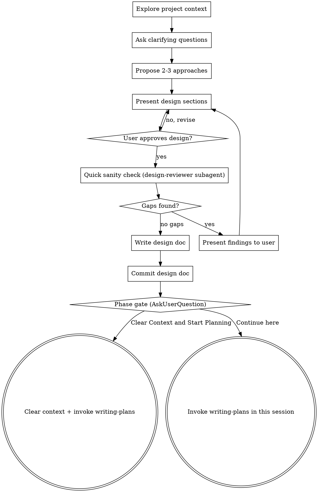

# Brainstorming Ideas Into Designs

## Overview

Help turn ideas into fully formed designs and specs through natural collaborative dialogue.

Start by understanding the current project context, then ask questions one at a time to refine the idea. Once you understand what you're building, present the design and get user approval.

<HARD-GATE>
Do NOT invoke any implementation skill, write any code, scaffold any project, or take any implementation action until you have presented a design and the user has approved it. This applies to EVERY project regardless of perceived simplicity.
</HARD-GATE>

## Anti-Pattern: "This Is Too Simple To Need A Design"

Every project goes through this process. A todo list, a single-function utility, a config change — all of them. "Simple" projects are where unexamined assumptions cause the most wasted work. The design can be short (a few sentences for truly simple projects), but you MUST present it and get approval.

## Checklist

You MUST create a task for each of these items and complete them in order:

1. **Explore project context** — check files, docs, recent commits
2. **Ask clarifying questions** — one at a time, understand purpose/constraints/success criteria
3. **Propose 2-3 approaches** — with trade-offs and your recommendation
4. **Present design** — in sections scaled to their complexity, get user approval after each section
5. **Quick sanity check** — dispatch super-bear:design-reviewer subagent for a lightweight fresh-eyes review; incorporate valid gaps, present findings to user alongside design
6. **Write design doc** — save to `docs/plans/YYYY-MM-DD-<topic>-design.md` and commit
7. **Phase gate** — use AskUserQuestion to offer transition options (see Phase Gate section below)

## Process Flow

**The terminal state is the phase gate.** Do NOT invoke frontend-design, mcp-builder, or any other implementation skill. The ONLY skill invoked after brainstorming is writing-plans (via the phase gate).

## The Process

**Understanding the idea:**
- Check out the current project state first (files, docs, recent commits)
- Ask questions one at a time to refine the idea
- Prefer multiple choice questions when possible, but open-ended is fine too
- Only one question per message - if a topic needs more exploration, break it into multiple questions
- Focus on understanding: purpose, constraints, success criteria

**Exploring approaches:**
- Propose 2-3 different approaches with trade-offs
- Present options conversationally with your recommendation and reasoning
- Lead with your recommended option and explain why

**Presenting the design:**
- Once you believe you understand what you're building, present the design
- Scale each section to its complexity: a few sentences if straightforward, up to 200-300 words if nuanced
- Ask after each section whether it looks right so far
- Cover: architecture, components, data flow, error handling, testing
- Be ready to go back and clarify if something doesn't make sense

## Quick Design Sanity Check

After the user approves the design sections, dispatch a `design-reviewer` subagent with the design and the user's original request (not your interpretation — their actual words).

The reviewer produces two things:
1. A **readback** — restating the design in their own words so the user can spot if it means something different than intended
2. **Yes/no questions** about assumptions the design makes that the user never explicitly confirmed

**Present the reviewer's output DIRECTLY to the user without editing or filtering it.** You (the lead) may have made these assumptions — that's exactly what this check catches. Do not dismiss or pre-answer any questions. Let the user respond.

After the user answers:
- Revise the design based on their answers if needed
- Then proceed to writing the design doc
- If the user confirms everything matches, proceed directly

## After the Design

**Documentation:**
- Write the validated design to `docs/plans/YYYY-MM-DD-<topic>-design.md`
- Use elements-of-style:writing-clearly-and-concisely skill if available
- Commit the design document to git

**Phase Gate — Transition to Planning:**

After the design doc is committed, use the `AskUserQuestion` tool to present the user with transition options:

Question: "Design is complete and committed. How would you like to proceed to implementation planning?"

Options:
1. **"Clear Context and Start Planning" (Recommended)** — Clears the conversation context (brainstorming back-and-forth is no longer needed), then invokes writing-plans skill fresh with just the committed design doc as input. This gives the planning phase clean, focused context.
2. **"Continue Planning in This Session"** — Keeps the current conversation context and invokes writing-plans directly. Use if you want to reference brainstorming discussion during planning.

**If user chooses "Clear Context and Start Planning":**
- Summarize: "Starting fresh planning session. The design doc at `docs/plans/<filename>` will be the input."
- Use /clear or equivalent to reset context
- Then invoke writing-plans skill, reading the committed design doc as the starting artifact

**If user chooses "Continue here":**
- Invoke writing-plans skill directly in the current session

## Key Principles

- **One question at a time** - Don't overwhelm with multiple questions
- **Multiple choice preferred** - Easier to answer than open-ended when possible
- **YAGNI ruthlessly** - Remove unnecessary features from all designs
- **Explore alternatives** - Always propose 2-3 approaches before settling
- **Incremental validation** - Present design, get approval before moving on
- **Be flexible** - Go back and clarify when something doesn't make sense
