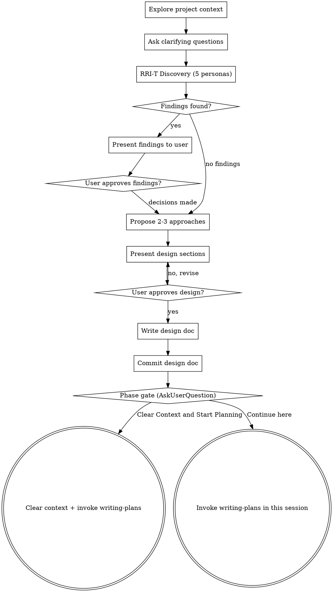

# Brainstorming Ideas Into Designs

## Overview

Help turn ideas into fully formed designs and specs through natural collaborative dialogue.

Start by understanding the current project context, then ask questions one at a time to refine the idea. Once you understand what you're building, present the design and get user approval.

<HARD-GATE>
Do NOT invoke any implementation skill, write any code, scaffold any project, or take any implementation action until you have presented a design and the user has approved it. This applies to EVERY project regardless of perceived simplicity.
</HARD-GATE>

## Anti-Pattern: "This Is Too Simple To Need A Design"

Every project goes through this process. A todo list, a single-function utility, a config change — all of them. "Simple" projects are where unexamined assumptions cause the most wasted work. The design can be short (a few sentences for truly simple projects), but you MUST present it and get approval.

## Checklist

You MUST create a task for each of these items and complete them in order:

1. **Explore project context** — check files, docs, recent commits
2. **Ask clarifying questions** — one at a time, understand purpose/constraints/success criteria
3. **RRI-T Discovery** — invoke super-bear:rri-t with DISCOVER phase; 5 personas identify hidden requirements from their perspectives; present consolidated findings to user for approval; user decisions inform approach selection
4. **Propose 2-3 approaches** — with trade-offs and your recommendation, informed by discovery findings
5. **Present design** — in sections scaled to their complexity, get user approval after each section
6. **Write design doc** — save to `docs/plans/YYYY-MM-DD-<topic>-design.md` and commit
7. **Phase gate** — use AskUserQuestion to offer transition options (see Phase Gate section below)

## Process Flow

**The terminal state is the phase gate.** Do NOT invoke frontend-design, mcp-builder, or any other implementation skill. The ONLY skills invoked during brainstorming are rri-t (discovery phase, before approaches) and writing-plans (via the phase gate).

## The Process

**Understanding the idea:**
- Check out the current project state first (files, docs, recent commits)
- Ask questions one at a time to refine the idea
- Prefer multiple choice questions when possible, but open-ended is fine too
- Only one question per message - if a topic needs more exploration, break it into multiple questions
- Focus on understanding: purpose, constraints, success criteria

**Exploring approaches:**
- Propose 2-3 different approaches with trade-offs
- Present options conversationally with your recommendation and reasoning
- Lead with your recommended option and explain why

**Presenting the design:**
- Once you believe you understand what you're building, present the design
- Scale each section to its complexity: a few sentences if straightforward, up to 200-300 words if nuanced
- Ask after each section whether it looks right so far
- Cover: architecture, components, data flow, error handling, testing
- Be ready to go back and clarify if something doesn't make sense

## RRI-T Discovery Phase

After user Q&A (step 2), invoke `super-bear:rri-t` with phase=DISCOVER. This happens **before** proposing approaches so that discovery findings inform the design, not retroactively patch it.

The RRI-T skill creates a team of 5 persona agents (End User, BA, QA Destroyer, DevOps, Security Auditor). Each persona reads the relevant code areas and identifies hidden requirements from their perspective.

The lead (you) receives a consolidated findings list and presents it to the user as a checklist:

- **MISSING** items — things users will need that aren't covered
- **PAINFUL** items — things that will frustrate users

**Present findings DIRECTLY to the user.** Do not filter or pre-answer. Let the user approve, reject, or modify each item.

After the user responds:
- Use approved findings to inform approach proposals (step 4)
- Relay user decisions to the RRI-T team (they update their findings files)
- If no findings, proceed directly to proposing approaches

**Note:** The RRI-T team stays alive for the PLAN_REVIEW phase (invoked by writing-plans skill). If the user chooses "Clear Context and Start Planning" at the phase gate, the team will be reconstructed from findings files in the new session.

## After the Design

**Documentation:**
- Write the validated design to `docs/plans/YYYY-MM-DD-<topic>-design.md`
- Use elements-of-style:writing-clearly-and-concisely skill if available
- Commit the design document to git

**Phase Gate — Transition to Planning:**

After the design doc is committed, use the `AskUserQuestion` tool to present the user with transition options:

Question: "Design is complete and committed. How would you like to proceed to implementation planning?"

Options:
1. **"Clear Context and Start Planning" (Recommended)** — Clears the conversation context (brainstorming back-and-forth is no longer needed), then invokes writing-plans skill fresh with just the committed design doc as input. This gives the planning phase clean, focused context.
2. **"Continue Planning in This Session"** — Keeps the current conversation context and invokes writing-plans directly. Use if you want to reference brainstorming discussion during planning.

**If user chooses "Clear Context and Start Planning":**
- Summarize: "Starting fresh planning session. The design doc at `docs/plans/<filename>` will be the input."
- Use /clear or equivalent to reset context
- Then invoke writing-plans skill, reading the committed design doc as the starting artifact

**If user chooses "Continue here":**
- Invoke writing-plans skill directly in the current session

## Key Principles

- **One question at a time** - Don't overwhelm with multiple questions
- **Multiple choice preferred** - Easier to answer than open-ended when possible
- **YAGNI ruthlessly** - Remove unnecessary features from all designs
- **Explore alternatives** - Always propose 2-3 approaches before settling
- **Incremental validation** - Present design, get approval before moving on
- **Be flexible** - Go back and clarify when something doesn't make sense
