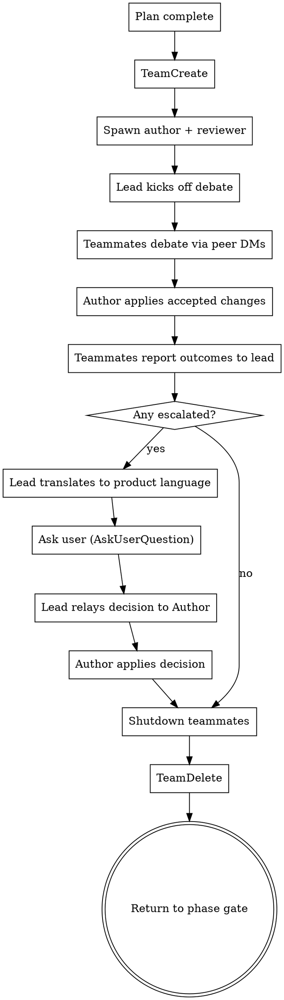

# Design Cross-Check (Agent Team Debate)

## Overview

After an implementation plan is drafted, this skill spawns an Agent Team for a structured debate between the plan's Author and an independent Reviewer. The goal is to catch gaps, missing dependencies, and flawed assumptions before code gets written.

**This is the last quality gate before implementation.** The debate is real — the Author pushes back when they have good reasons, and unresolved disagreements escalate to the user in plain product language (no code, no technical jargon).

**Announce at start:** "I'm using the design-cross-check skill to challenge this plan through an Author vs. Reviewer debate."

## Prerequisites

- `CLAUDE_CODE_EXPERIMENTAL_AGENT_TEAMS=1` must be enabled
- A drafted implementation plan (output of writing-plans skill)
- The approved design document
- A summary of the user's original request

## Debate Roles

| Role | Spawned As | Communicates With | Responsibility |
|------|-----------|-------------------|----------------|
| **Lead** | Main session (you) | Both teammates (SendMessage) | Orchestrates, receives outcome reports, translates escalations to product language for user, relays user decisions back to Author |
| **Reviewer** | Teammate via Task(team_name) | Author (peer DMs) + Lead (outcome reports) | Challenges plan, sends concerns one at a time. Fresh eyes — no conversation history. |
| **Author** | Teammate via Task(team_name) | Reviewer (peer DMs) + Lead (outcome reports) | Defends plan, applies accepted changes to plan document, applies user decisions on escalated items |

Use the spawn templates in this skill's directory:
- `author-teammate-prompt.md` — template for the Author teammate
- `reviewer-teammate-prompt.md` — template for the Reviewer teammate

**Why peer DMs:** The debate happens in the teammates' context windows, not the lead's. This keeps the lead's context lean — it only receives short outcome reports. Teammates maintain persistent context across rounds (unlike subagents, which lose context between dispatches).

## Debate Protocol



### Step-by-step with actual API calls:

**1. Create the team:**
```
TeamCreate("plan-review")
```

**2. Spawn teammates** (read the template files, fill placeholders with artifacts, spawn):
```
Task(team_name="plan-review", name="reviewer", prompt=[reviewer-teammate-prompt.md with {ARTIFACT_CONTENT}])
Task(team_name="plan-review", name="author", prompt=[author-teammate-prompt.md with {ARTIFACT_CONTENT} and {USER_REQUEST_SUMMARY}])
```

**3. Kick off the debate:**
```
SendMessage(type="message", recipient="reviewer",
  content="Review the plan. Send your concerns to author one at a time via DM. After each concern resolves or hits 3 rounds, message me with the outcome.")

SendMessage(type="message", recipient="author",
  content="Reviewer will DM you concerns. Debate directly. When you accept a concern, apply the change to the plan document immediately. After each concern resolves or hits 3 rounds, message me with the outcome.")
```

**4. Lead waits.** Teammates debate via peer DMs in their own context windows. Lead receives brief summaries in idle notifications and full outcome reports via SendMessage.

**5. Lead receives outcome messages** from both teammates:
- `"Concern: [label]. RESOLVED_ACCEPTED. Plan updated: [what changed]."`
- `"Concern: [label]. RESOLVED_DEFENDED. No plan change. Reason: [reason]."`
- `"Concern: [label]. ESCALATED after 3 rounds. Reviewer: [position]. Author: [position]."`

**6. After all concerns reported:**
- If any ESCALATED → Lead translates to product language using `escalation-guide.md`, asks user via AskUserQuestion
- Lead relays user decisions to Author:
  ```
  SendMessage(type="message", recipient="author",
    content="User decided: [decision]. Apply this to the plan.")
  ```
- Author applies the changes and confirms

**7. Shutdown:**
```
SendMessage(type="shutdown_request", recipient="reviewer")
SendMessage(type="shutdown_request", recipient="author")
TeamDelete
```

**8. Return control** to writing-plans skill for phase gate.

## Escalation Format

When translating disagreements for the user, use this format (see `escalation-guide.md` for translation examples):

```
The team has a question for you:

**What they agree on:** [summary of common ground]

**Where they see it differently:**
- One view: [framed as user/product impact]
- Other view: [framed as user/product impact]

**What this means for your product:** [plain language tradeoff]

**Your call:** [Simple question the user can answer]
```

## Translation Rules (for Lead)

When presenting disagreements to the user:

- **NEVER mention:** API, endpoint, database, schema, module, component, refactor, architecture, interface, abstraction, file paths, function names, code
- **ALWAYS frame as:** what users will experience, tradeoffs in everyday terms, impact on the product

## User Override

If the user says "skip the review" or "just proceed" at any point, respect that immediately — shut down the team and move on. The user is always in control.

If the user says "skip" during a specific concern, stop debating that concern and move to the next one.

## Cost

The debate happens in the teammates' context windows — the lead's context only grows by N short outcome messages (one per concern). Teammates use their own token budgets for the debate. Author applies changes directly to the plan document (no lead interpretation needed).

This is intentionally the most expensive review step — it's the last gate before code gets written. The cost of catching a plan error here is much lower than discovering it hours into execution.

User can say "skip the review" at any point to stop.
